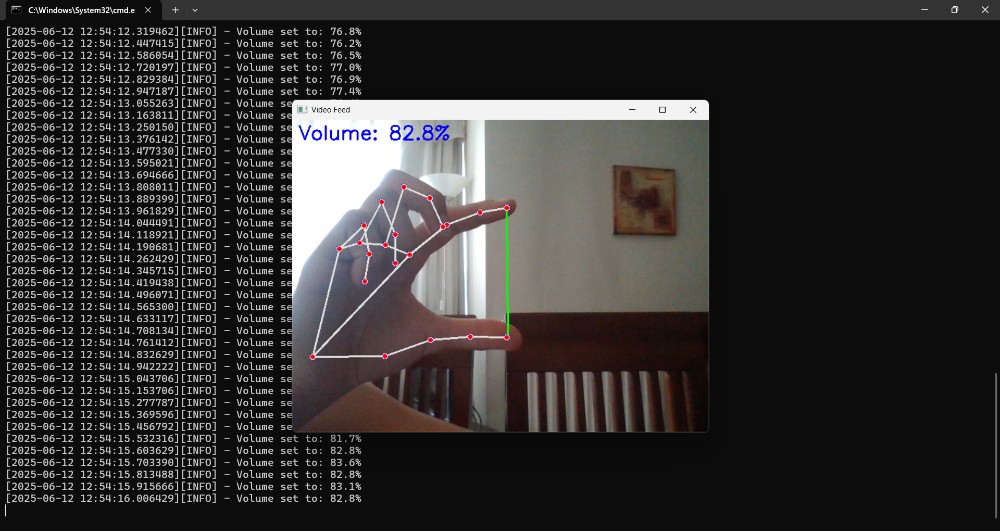

# 🖐 Hand-Controlled Volume via Machine Vision

Control your computer's volume using just your hand gestures with this python based machine vision tool powered by OpenCV and MediaPipe



---

## Features

- Real-time hand tracking using MediaPipe
- Dynamic system volume control based on finger distance
- Face detection using Haar cascades
- Visual feedback with hand landmarks and volume percentage

---

## 🛠Installation

### 1. Clone the repository

```bash
git clone https://github.com/jimmydin7/hand-to-volume-machine-vision.git
cd hand-to-volume-machine-vision
